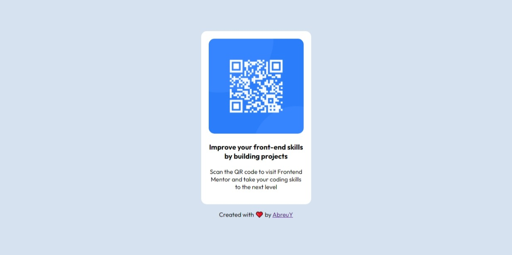

# Frontend Mentor - QR code component solution

This is a solution to the [QR code component challenge on Frontend Mentor](https://www.frontendmentor.io/challenges/qr-code-component-iux_sIO_H). Frontend Mentor challenges help you improve your coding skills by building realistic projects. 

### Screenshot

### Links

- Solution URL: [Github URL repository](https://github.com/AbreuY/qr-code-component-exercise)

## My process

### Built with

- HTML5
- CSS
- Flexbox

### What I learned

I'm the learning process of HTML5 and CSS

To see how you can add code snippets, see below:

## Author

- Github - [AbreuY](https://github.com/AbreuY)

